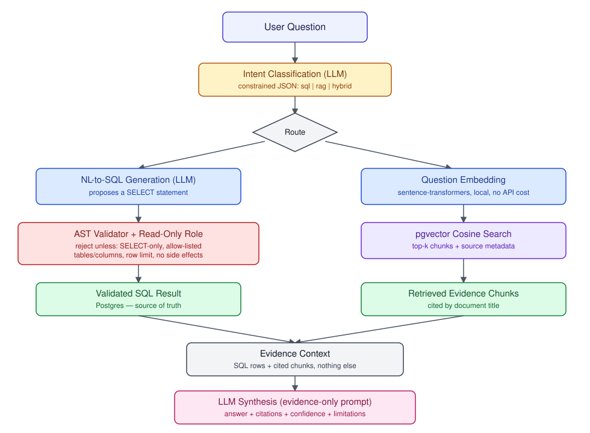

# InsightQuery

AI-powered data investigation and analytics platform. Ask a natural-language question about
Chicago crime data; get back a deterministic SQL result and/or retrieved document evidence,
synthesized into a grounded answer with citations — never an LLM guess.



Full design rationale: [ARCHITECTURE.md](ARCHITECTURE.md).

## Why this exists

Most "chat with your data" demos let an LLM write and run arbitrary SQL, or let it answer
from "vibes" instead of evidence. InsightQuery treats the LLM as a narrator, not a source of
truth: structured questions are answered by validated, read-only SQL against a real Postgres
schema (see [docs/SQL_SAFETY.md](docs/SQL_SAFETY.md)); document questions are answered by
retrieval against an embedded corpus in pgvector (see [docs/RAG_EVALUATION.md](docs/RAG_EVALUATION.md));
the LLM's only job is to explain what the deterministic systems already found, citing its
sources, and to say "insufficient evidence" when that's the honest answer.

## Setup

**Prerequisites:** Docker Desktop (with WSL2 backend on Windows), Python 3.11+, an
[Anthropic API key](https://console.anthropic.com/). Every command below has actually
been run end-to-end against a real Docker deployment — see "Verified" below.

```bash
# 1. Clone and configure
cp .env.example .env          # then fill in ANTHROPIC_API_KEY
# Note: the db container maps to host port 5433, not 5432, in case this machine already
# runs a native Postgres on 5432 (see the comment in docker-compose.yml) — .env.example
# already points at 5433, no change needed unless you edit the port mapping yourself.

# 2. Start Postgres + pgvector
docker compose up -d db

# 3. Python environment
python -m venv .venv
source .venv/Scripts/activate  # Windows Git Bash; use .venv\Scripts\Activate.ps1 for PowerShell
pip install -r requirements.txt

# 4. Create schema and apply the least-privilege read-only role's grants
alembic upgrade head
docker exec -i insightquery-db psql -U insightquery -d insightquery < scripts/grant_readonly.sql

# 5. Load data (one-time; pulls live from the Chicago open data portal).
# PYTHONPATH=. is required so these scripts can import the `app` package.
PYTHONPATH=. python scripts/fetch_data.py
PYTHONPATH=. python scripts/ingest_data.py
PYTHONPATH=. python scripts/ingest_documents.py

# 6. Run the API
PYTHONPATH=. uvicorn app.main:app --reload --port 8000
# docs at http://localhost:8000/docs
```

Or build/run the API in Docker too: `docker compose up -d` (after steps 4-5, which need
to run once against the containerized DB — see `docker-compose.yml`).

### Verified

This exact sequence was run against a real Docker Desktop (WSL2 backend) deployment on
2026-09-23: 263,841 real 2023 Chicago crime records loaded, 15 reference documents
chunked/embedded/loaded, `/health` returns healthy, `/rag/retrieve` returns correct
results, and the `insightquery_readonly` role was confirmed to `SELECT` successfully on
the four analytics tables while being denied `INSERT`/`DROP`/`DELETE` and denied `SELECT`
on `query_log`/`documents`/`document_chunks`. Adversarial SQL injection testing (14 attack
patterns — stacked statements, comment smuggling, schema enumeration, function abuse,
`COPY ... TO PROGRAM`, UNION-based credential exfiltration) was blocked entirely by the
existing validator. See [docs/SQL_SAFETY.md](docs/SQL_SAFETY.md) and
[docs/SECURITY.md](docs/SECURITY.md) for full results, including two real bugs this
testing found and fixed.

### Running tests

```bash
pytest -q
```

80+ tests cover the SQL-safety adversarial matrix, chunking, the API contract, LLM-outage
resilience, and analytics-query syntax — all runnable without a live database or API key.
Full integration coverage (real ingestion, real retrieval) needs the database from the
setup steps above.

### Evaluating RAG retrieval quality

```bash
python scripts/evaluate_rag.py --top-k 5
```

Writes a full per-question report to `docs/rag_eval_results.json`. See
[docs/RAG_EVALUATION.md](docs/RAG_EVALUATION.md) for methodology and honest limitations.

## Demo walkthrough

Ask something like *"How did theft change over month to month in 2023, and is there a
seasonal explanation?"* against `POST /investigate`:

```
Question
  -> intent: "hybrid" (needs both a number and context)
  -> SQL generated + validated + executed (Postgres, read-only role)      <- source of truth
  -> documents retrieved (pgvector cosine search)                         <- source of truth
  -> LLM synthesis, given ONLY the SQL rows + retrieved chunks above
  -> Answer, with every number traceable to the SQL and every claim cited
```

The `/investigate` response includes the generated SQL, its validation verdict, the raw
result rows, the retrieved evidence chunks with source titles, and the final synthesized
answer — the point is that a reviewer can see every step, not just trust the last one.

## Project layout

```
app/
  api/        FastAPI routes
  analytics/  hand-written deterministic SQL (trends, comparisons, anomalies)
  core/       config, logging
  db/         SQLAlchemy engine/session
  llm/        Anthropic client, prompts, evidence-grounded synthesis
  models/     SQLAlchemy models
  nlsql/      NL-to-SQL generation, AST validator, read-only executor
  rag/        chunking, embeddings, pgvector retrieval
  schemas/    Pydantic request/response models
  services/   intent classification, investigation orchestration
data/
  documents/  15 curated RAG reference documents + manifest
  raw/        fetched-but-uncleaned source snapshots (gitignored)
  processed/  reserved for cleaned intermediates (gitignored)
scripts/      fetch/ingest/evaluate CLIs, DB role setup SQL
docs/         architecture diagram, SQL safety, security, RAG eval, limitations
```

See [ARCHITECTURE.md](ARCHITECTURE.md) for the full schema/API/security design, and
`docs/` for SQL safety, RAG evaluation, security, and known-limitations writeups.
